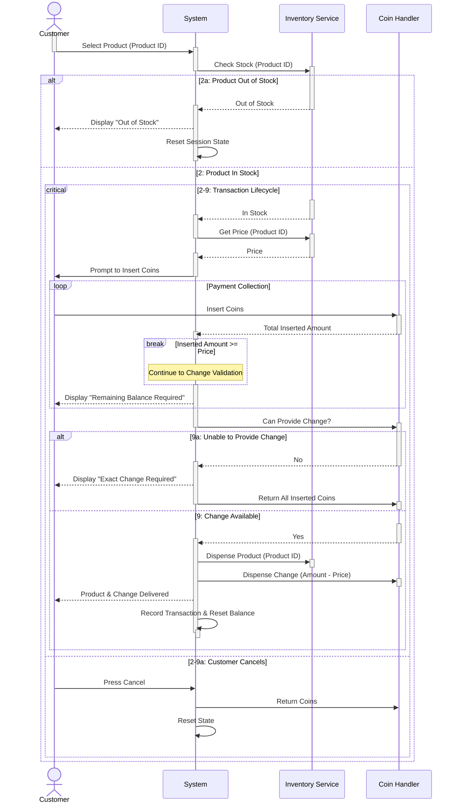

```mermaid
sequenceDiagram
    %% autonumber
    actor Customer
    participant System
    participant Inventory as Inventory Service
    participant Bank as Coin Handler

    activate Customer
    Customer->>+System: Select Product (Product ID)
    deactivate Customer
    
    System->>+Inventory: Check Stock (Product ID)
    deactivate System

    alt 2a: Product Out of Stock
        Inventory-->>+System: Out of Stock
        deactivate Inventory
        System-->>Customer: Display "Out of Stock"
        System->>-System: Reset Session State
    else 2: Product In Stock     
        critical 2-9: Transaction Lifecycle  
            activate Inventory
            Inventory-->>+System: In Stock  
            deactivate Inventory
            System->>+Inventory: Get Price (Product ID)
            deactivate System
            Inventory-->>+System: Price
            deactivate Inventory
            System->>-Customer: Prompt to Insert Coins

            loop Payment Collection
                Customer->>+Bank: Insert Coins
                Bank-->>-System: Total Inserted Amount
                activate System
                deactivate System
                
                break Inserted Amount >= Price
                    Note over System: Continue to Change Validation
                end
                
                activate System
                System-->>Customer: Display "Remaining Balance Required"
            end

            System->>+Bank: Can Provide Change?
            deactivate System
            
            alt 9a: Unable to Provide Change
                Bank-->>+System: No
                deactivate Bank
                System-->>Customer: Display "Exact Change Required"
                System->>+Bank: Return All Inserted Coins
                deactivate System
                deactivate Bank
            else 9: Change Available
                activate Bank
                Bank-->>+System: Yes
                deactivate Bank
                System->>+Inventory: Dispense Product (Product ID)
                deactivate Inventory
                System->>+Bank: Dispense Change (Amount - Price)
                deactivate Bank
                System-->>Customer: Product & Change Delivered
                System->>+System: Record Transaction & Reset Balance
                deactivate System
                deactivate System
            end
        option 2-9a: Customer Cancels
            Customer->>System: Press Cancel
            System->>Bank: Return Coins
            System->>System: Reset State
        end
    end
```