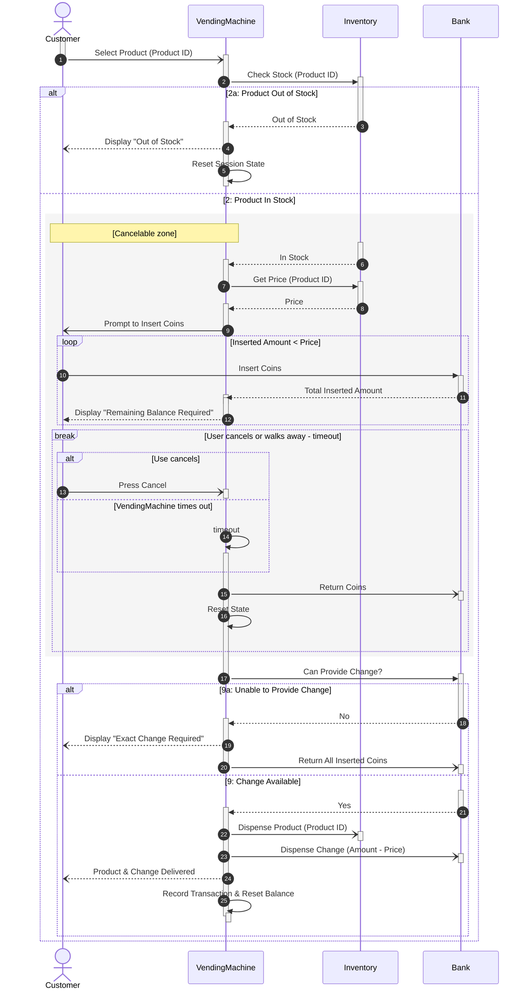

```mermaid
sequenceDiagram
    autonumber
    actor Customer
    participant VendingMachine
    participant Inventory
    participant Bank

    activate Customer
    Customer-)+VendingMachine: Select Product (Product ID)
    deactivate Customer
    
    VendingMachine->>+Inventory: Check Stock (Product ID)
    deactivate VendingMachine

    alt 2a: Product Out of Stock
        Inventory-->>+VendingMachine: Out of Stock
        deactivate Inventory
        VendingMachine--)Customer: Display "Out of Stock"
        VendingMachine->>-VendingMachine: Reset Session State
    else 2: Product In Stock
        rect rgb(245, 245, 245)
            Note over Customer, VendingMachine: [Cancelable zone]  
            activate Inventory
            Inventory-->>+VendingMachine: In Stock  
            deactivate Inventory
            VendingMachine->>+Inventory: Get Price (Product ID)
            deactivate VendingMachine
            Inventory-->>+VendingMachine: Price
            deactivate Inventory
            VendingMachine-)-Customer: Prompt to Insert Coins

            loop Inserted Amount < Price
                Customer->>+Bank: Insert Coins
                Bank-->>-VendingMachine: Total Inserted Amount
                activate VendingMachine
                deactivate VendingMachine
                
                activate VendingMachine
                VendingMachine-->>-Customer: Display "Remaining Balance Required"
            end
            break User cancels or walks away - timeout
                alt Use cancels
                    Customer-)+VendingMachine: Press Cancel
                    deactivate VendingMachine
                else VendingMachine times out 
                    VendingMachine ->>+VendingMachine: timeout
                end
                VendingMachine-)+Bank: Return Coins
                deactivate Bank
                VendingMachine->>VendingMachine: Reset State
            end
        end
        

        VendingMachine->>+Bank: Can Provide Change?
        deactivate VendingMachine
        
        alt 9a: Unable to Provide Change
            Bank-->>+VendingMachine: No
            deactivate Bank
            VendingMachine--)Customer: Display "Exact Change Required"
            VendingMachine-)+Bank: Return All Inserted Coins
            deactivate VendingMachine
            deactivate Bank
        else 9: Change Available
            activate Bank
            Bank-->>+VendingMachine: Yes
            deactivate Bank
            VendingMachine-)+Inventory: Dispense Product (Product ID)
            deactivate Inventory
            VendingMachine-)+Bank: Dispense Change (Amount - Price)
            deactivate Bank
            VendingMachine--)Customer: Product & Change Delivered
            VendingMachine->>+VendingMachine: Record Transaction & Reset Balance
            deactivate VendingMachine
            deactivate VendingMachine
        end
    end
```