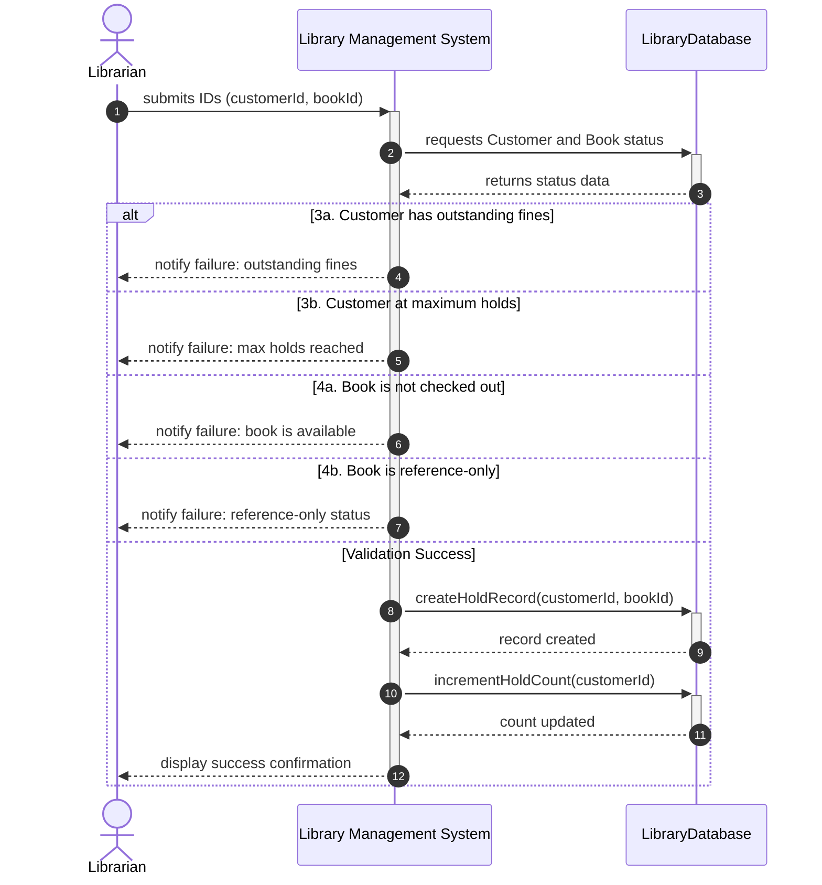

# Design Lab Output

## Use Case

# USE CASE: Place Hold on Checked-Out Book
**Primary Actor:** Librarian

**System:** Library Management System

**Secondary Actors:** LibraryDatabase

## 1. Context & Boundaries
- **Goal:** Place a hold on a specific checked-out book for a library customer.
- **Preconditions:** The Librarian is authenticated; the Customer and Book exist in the database.
- **Success Guarantee:** A new hold record is created and the Customer's active hold count is updated.
- **Failure Guarantee:** No hold record is created and the system remains in its previous state.

## 2. Data Models
- CustomerRecord, BookRecord, HoldRecord, SystemConstants

## 3. Main Success Scenario (The Happy Path)
1. Librarian submits the Customer ID and Book ID to the System.
2. System requests Customer and Book status from the LibraryDatabase.
3. System validates that the Customer has zero outstanding fines and active holds below the maximum limit.
4. System validates that the Book is currently checked out and is not classified as 'reference-only'.
5. System instructs the LibraryDatabase to create a new hold record linked to the Customer and Book.
6. System instructs the LibraryDatabase to increment the Customer's active hold count.
7. System displays a success confirmation to the Librarian.

## 4. Extensions (The Edge Cases)
* 3a. Customer has outstanding fines:
    * 3a1. System informs the Librarian of the failure due to outstanding fines and terminates the process.
* 3b. Customer has reached or exceeded SYSTEM_MAX_HOLDS:
    * 3b1. System informs the Librarian that the maximum number of holds has been reached and terminates the process.
* 4a. Book is not currently checked out:
    * 4a1. System informs the Librarian that the book is available and does not require a hold, then terminates the process.
* 4b. Book is classified as 'reference-only':
    * 4b1. System informs the Librarian that the book cannot be put on hold due to its reference-only status and terminates the process.

## Sequence Diagram

