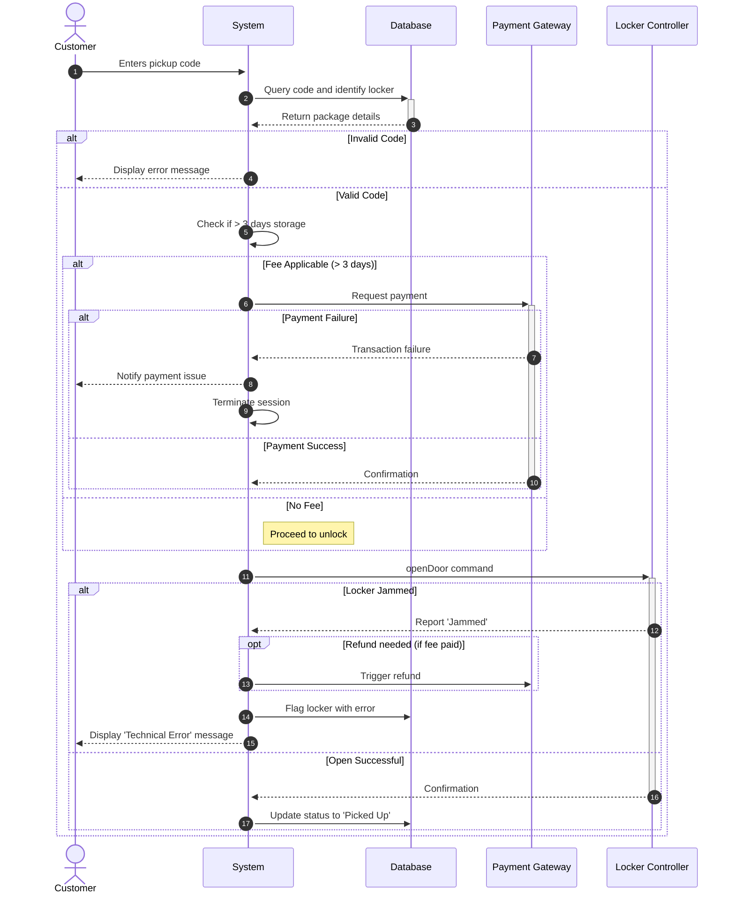

# Design Lab Output

## Use Case

# USE CASE: Smart Package Locker Pickup
**Primary Actor:** Customer

**System:** Package Locker System

**Secondary Actors:** Locker Controller, Payment Gateway, Database

## 1. Context & Boundaries
- **Goal:** Retrieve a package from a secure locker.
- **Preconditions:** The customer has a valid pickup code and the package is present in the locker system.
- **Success Guarantee:** The locker door opens, the package status is updated to 'Picked Up', and any required fees are settled.
- **Failure Guarantee:** The locker remains locked, the user is notified of the issue, and any processed fees are refunded if a hardware failure occurs.

## 2. Data Models
- PackageRecord, PaymentTransaction, LockerStatus

## 3. Main Success Scenario (The Happy Path)
1. Customer enters the pickup code into the system UI.
2. System queries the Database to validate the code and identify the associated locker.
3. System determines if the package has exceeded the 3-day storage limit.
4. System calculates the late fee and requests payment from the Payment Gateway.
5. Payment Gateway confirms successful processing.
6. System sends an 'openDoor' command to the Locker Controller.
7. Locker Controller confirms successful door opening.
8. System updates the Database to mark the package status as 'Picked Up'.

## 4. Extensions (The Edge Cases)
* 2a. Pickup code is invalid: 
    * 2a1. System displays an error message informing the customer the code is invalid.
* 3a. Package age is less than or equal to 3 days: 
    * 3a1. System skips the fee processing and proceeds directly to step 6.
* 4a. Payment Gateway reports a transaction failure:
    * 4a1. System notifies the Customer that the payment could not be processed.
    * 4a2. System terminates the session and retains the package in the locker.
* 7a. Locker Controller reports 'Jammed' status:
    * 7a1. If a fee was previously processed, the system triggers an automated refund request to the Payment Gateway.
    * 7a2. System updates the Database to flag the locker with a technical error.
    * 7a3. System displays a 'Technical Error - Please contact building management' message to the Customer.

## Sequence Diagram

