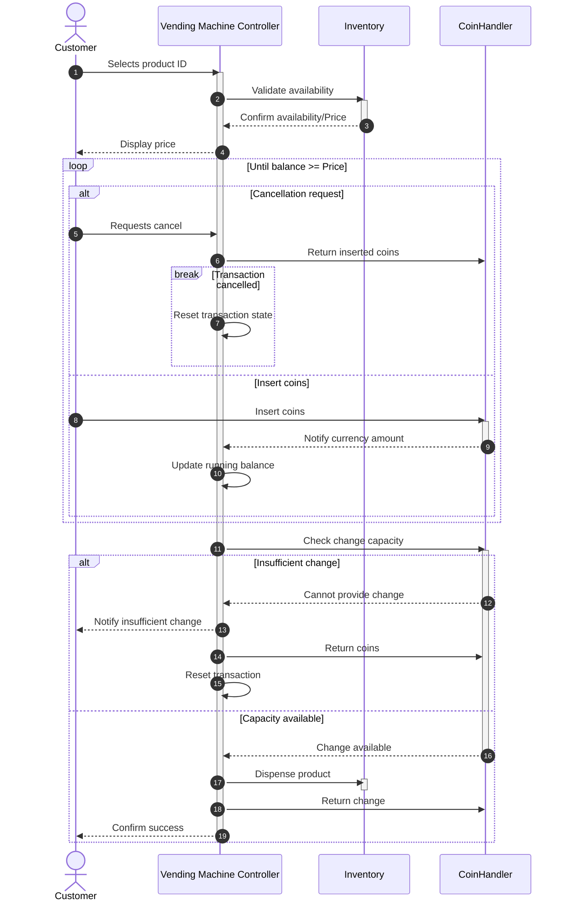

# Design Lab Output

## Use Case

# USE CASE: Purchase Product from Vending Machine
**Primary Actor:** Customer

**System:** Vending Machine Controller

**Secondary Actors:** CoinHandler (Bank), Inventory

## 1. Context & Boundaries
- **Goal:** Customer successfully purchases a product from the machine.
- **Preconditions:** Machine is powered on, has inventory, and has sufficient change capacity.
- **Success Guarantee:** Customer receives product and correct change; machine records the sale and updates stock/coin counts.
- **Failure Guarantee:** Transaction reverts, all inserted coins are returned to the Customer, and machine state is reset.

## 2. Data Models
- Product (ID, Price, StockLevel)
- TransactionState (SelectedProduct, CurrentBalance)

## 3. Main Success Scenario (The Happy Path)
1. Customer selects a product ID.
2. System validates product existence and stock availability via Inventory.
3. System displays price to the Customer.
4. Customer inserts coins; CoinHandler notifies System of currency amount.
5. System tracks running balance until balance >= price.
6. System checks CoinHandler for ability to return necessary change.
7. System signals Inventory to dispense product.
8. System signals CoinHandler to return correct change to Customer.
9. System confirms success to Customer.

## 4. Extensions (The Edge Cases)
* 1a. Selected product is out of stock:
    * 1a1. System notifies the Customer and resets the interface.
* 2a. Customer requests cancellation before payment completes:
    * 2a1. System commands CoinHandler to return all inserted coins.
    * 2a2. System resets transaction state.
* 6a. CoinHandler cannot provide required change:
    * 6a1. System notifies Customer of insufficient change.
    * 6a2. System commands CoinHandler to return all inserted coins.
    * 6a3. System resets transaction.

## Sequence Diagram

